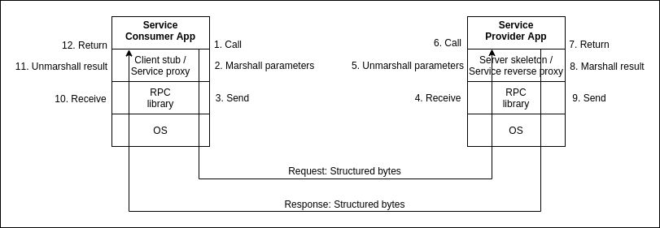
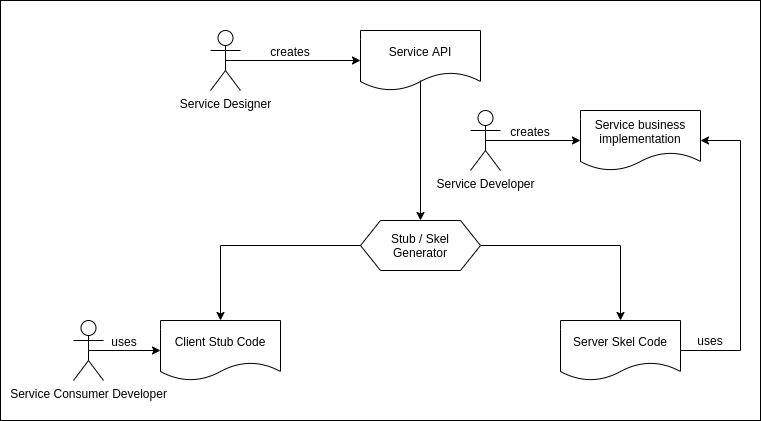
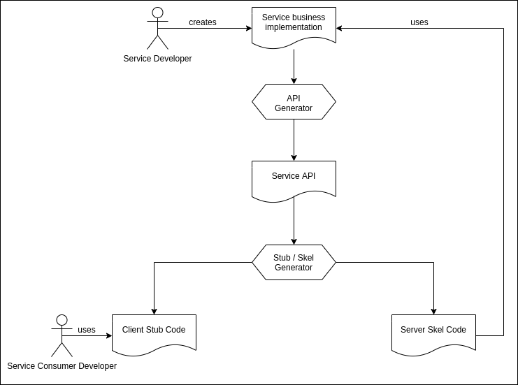

# Integration: Service Oriented Model / RPC Paradigm
## Problem
The client/server model allows different processes to communicate remotely. However, designing and developing a client/server application is tedious. Indeed, it requires:
- Designing a specific protocol or, in the best case, adopting and adapting an existing (maybe standard) protocol
- Managing connections, as well as corresponding streams, on both sides
- Implementing the protocol, including (application) error management, on both sides

Also, the more services/functionality the protocol supports, the more tedious the whole process becomes!

## Objective
Can we imagine a programming paradigm, which provides us software developers, with: *the luxury to invoke remote services/functionality, as if they were local*!?

Such a paradigm would by hide all the programming hassle and details mentioned above, hence:
- increase *devloper productivity*
- promote *software integration* for:
  - richer functionality
  - higher performance

## Examples
- Getting the weather of a given city from a specialized provider, such as Yahoo! Weather (seeking functionality): you don't have the necessary data to do it yourself!
- Translating text using a specialized service, such as Google Translate (seeking functionality): you don't have the algorithms and data to do it yourself!
- Inversing large matrices using a specialized service (seeking performance): you may not have the necessary processing power!

*As a matter of fact, cloud computing wouldn't be possible without such a paradigm!*

## Brainstorming
If you were to design and develop a traditional client/server application that allows the client to perform the four basic math operations (+ - x :) on the server,
- How would you go about it?
- What parts of your solution are really specific to this application?
- What parts of your solution could be generalized and used for other purposes and applications?

## Solution: RPC Paradigm -- Remote Procedure Call

 Figure 1. RPC Architecture

## History
See [History and origins on Wikipedia](https://en.wikipedia.org/wiki/Remote_procedure_call#History_and_origins)

## Key Concepts
### Service API
This is the contract between both parties: service provider and service consumer. It defines the prototypes of the methods/functions that are offered by the service provider and that can be invoked by the service consumer

### Service consumer
This is the party that consumes the service offered by the service provider. It needs to know nothing about the service implementation (one of the main purposes of RPC). Key conceprs related to the service consumer are:
- **Client stub or proxy:** implements the service API, but this is just a proxy/fake implementation, which gives the impression to the service consumer that it's invoking the remore business implementation as if it were local. It provides parameter marshalling and result unmarshalling.
- **Parameter marshalling:** serializing and packing parameters from their in-memory representation into a *structured* stream of bytes that is suitable for transport and from which parameters can be rebuilt (unmarshalled) by the server stub on the other side.
- **Result unmarshalling:** unpacking and deserializing the result from the stream of bytes sent ny the server stub into its in-memory representation.

### Service provider
This is the party that provides the business implementation of the service API. It publishes such an implementation under a well known location and responds to consumer invocations. Key concepts related to the service provider are:
- **Server stub or skeleton:** uses/wrapps the service business implementaion, while providing parameter unmarshalling and result marshalling.
- **Parameter unmarshalling:** unpacking and deserializing the parameters from the stream of bytes sent by the client stub into their in-memory representation.
- **Result marshalling:** serializing the result from its in-memory representation into a *structured* stream of bytes that is suitable for transport and from which the result can be rebuilt (unmarshalled) by the client stub on the other side.

## Runtime Flow

 Figure 2. RPC Runtime Flow

## Development Process
There are two main approaches: API-first and Code-first. Regardless of the approach, the server skeleton and the client stub are generated automatically from the service API/contract using the appropriate tool provided by the chosen technology.
### API-first Approach
As its name implies, this approach consits of designing the service API/contract first. Then, server-side code, as well as client-side code are created. From a design perspective, it's always a good practice to specify the API/contract before delving into the implementation.

 Figure 3. API-first Approach

However, it may not be an easy task to specify the contract in some interface definition languages, such as WSDL or RAML. In this case, some developers would prefer the code-first approach.

### Code-first Approach
In this approach, developers start by coding the service business implementation, or at least defining its business interface in a target programming language, such as Java, Python, JavaScript, etc. Then, they use an appropriate tool for the chosen technology to generate the service API. This won't be possible if such a tool doesn't exist for the chosen technology and target programming language.

 Figure 4. Code-first Approach

## Technologies
### Programming Language-Specific Technologies
In the traditional client/server model, the programming language of the client and the one of the server are not relevant to the interaction. What really matters is the protocol and how the exchanged messages are compliant with the protocol.

However, the luxury and abstraction provided by RPC has a cost. Invoking methods/functions remotely while passing parameters and getting results would require (a priori) that both the service provider and consumer be implemented in the same programming language. Indeed, function prototypes, as well as parameters and returned results types depend on the programming language.

Therfore, the first attempts to provide RPC implementations were language-specific. This is [a list on Wikipedia of such attempts](https://en.wikipedia.org/wiki/Remote_procedure_call#Language-specific).
### Programming Language-Agnostic Technologies
Humans always want more, right? Software developers wanted to overcome the language dependency constraint. The key was creating a service (API) definition language that positions itself at the same distance from all programming languages, with the possibility to serialize objects into a unified format and deserialize them back, no matter what their original and final language-dependent representations are.
#### CORBA (legacy) -- Common Object Request Broker Architecture
- Protocol: IIOP -- Internet Inter-ORB Protocol
- Service definition language: IDL -- Interface Definition Language
#### XML/SOAP (XS) Web Services
- Protocol: [SOAP -- Simple Object Access Protocol](https://www.w3.org/TR/soap/) (in practice, on top of HTTP, but using POST method only), by W3C
- Service definition language: [WSDL -- Web Service Definition Language](https://www.w3.org/TR/2001/NOTE-wsdl-20010315) (XML-based), by W3C
- [Case Study](./ws-xml-soap)
#### Restful (RS) Web Services
- Protocol: Raw HTTP, using GET, POST, PATCH, PUT and DELETE methods, and providing a natural mapping to CRUD operations, so suitable for data-oriented applications
- Service definition language: unspecified, but some popular languages have emerged:
  - [RAML](https://raml.org/) (YAML-based)
  - [OAS -- OpenAPI Specification](https://www.openapis.org/)
  - [Case Study](./rs-json-openapi)