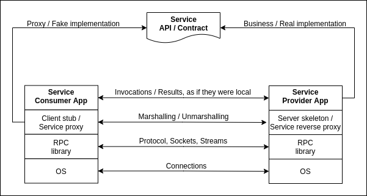

# Integration: Service Oriented Model / RPC Paradigm
## Problem
The client/server model allows different processes to communicate remotely. However, designing and developing a client/server application is tedious. Indeed, it requires:
- Designing a specific protocol or, in the best case, adopting and adapting an existing (maybe standard) protocol
- Managing connections, as well as corresponding streams, on both sides
- Implementing the protocol, including (application) error management, on both sides

Also, the more services/functionality the protocol supports, the more tedious the whole process becomes!
## Objective
Can we imagine a paradigm, which provides us software developers, with the *luxury* to invoke remote services/functionality, *as if they were local*!?

## Architecture

