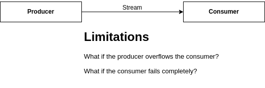
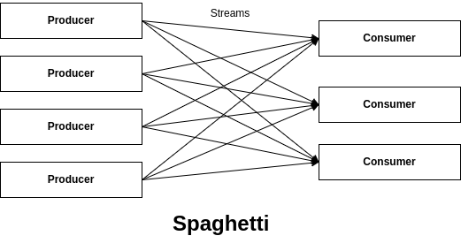
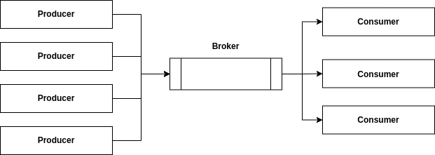

# Scalability: Distributed and Parallelized Programming
## Table of Contents
- Context
  - Big Data
  - High Performance Computing (HPC)
- The Need for Scalability
  - Scale in: vertical/hardware-based scalability
  - Scale out: horizontal/software-based scalability
- Parallelization and Cluster Computing
  - A motivating example
  - Map and Reduce parallelized operations
- Big Bang, then Sun, then Earth, then Life, then Homo Sapiens, then Electricity, then Internet, then [Hadoop](https://hadoop.apache.org/)
  - Hadoop Ecosystem
    - [YARN](https://hadoop.apache.org/docs/stable/hadoop-yarn/hadoop-yarn-site/YARN.html)
    - [HDFS](https://hadoop.apache.org/docs/r1.2.1/hdfs_design.html)
    - [MapReduce](https://hadoop.apache.org/docs/stable/hadoop-mapreduce-client/hadoop-mapreduce-client-core/MapReduceTutorial.html)
  - Hadoop Limitations (mainly HDFS-based, disk-driven computations)
- [Spark](https://spark.apache.org/docs/latest/index.html)
  - Services
    - Resource management
    - Distributed processing
      - [Resilient Distributed Datasets (RDDs)](https://spark.apache.org/docs/latest/rdd-programming-guide.html#resilient-distributed-datasets-rdds)
      - Operations: [Transformations](https://spark.apache.org/docs/latest/rdd-programming-guide.html#transformations) & [Actions](https://spark.apache.org/docs/latest/rdd-programming-guide.html#actions)
  - [Architecture](https://spark.apache.org/docs/latest/cluster-overview.html)
    - Cluster manager
      - [Spark Standalone](https://spark.apache.org/docs/latest/spark-standalone.html)
      - [YARN](https://hadoop.apache.org/docs/current/hadoop-yarn/hadoop-yarn-site/YARN.html)
      - [Kubernetes](https://kubernetes.io)
    - Driver program
      - SparkContext
    - Worker nodes
    - Executors
    - Tasks
  - [Java API](https://spark.apache.org/docs/latest/api/java/org/apache/spark/api/java/package-summary.html)
  - [Case Study: Ecommerce Product Rating](./case-studies/rating)
  - Installation (Spark Standalone)
  - Deployment (Manual)
    - ./sbin/start-master.sh
    - ./sbin/start-worker.sh
  - Application Deployment
    - [./bin/spark-submit.sh](https://spark.apache.org/docs/latest/submitting-applications.html)
- Streams
  - What is a stream?
  - What are events? "What happened happened!"
  - State-oriented systems vs. event-driven systems
  - Examples
  - Direct interaction / tight coupling between stream producers and consumers
    

    

  - Brokered interaction / loose coupling between stream producers and consumers
    

- [Kafka](https://kafka.apache.org/) - The De Facto Distributed ;Event Store and Stream Processing Platform
  - "Kafka was originally developed at LinkedIn, and was subsequently open sourced in early 2011. Jay Kreps, Neha Narkhede and Jun Rao helped co-create Kafka. Graduation from the Apache Incubator occurred on 23 October 2012. Jay Kreps chose to name the software after the author Franz Kafka because it is "a system optimized for writing", and he liked Kafka's work." - [Wikipedia](https://en.wikipedia.org/wiki/Apache_Kafka).
  - "Franz Kafka (1883 - 1924) was a German-speaking Bohemian novelist and short-story writer based in Prague, who is widely regarded as one of the major figures of 20th-century literature." - [Wikipedia](https://en.wikipedia.org/wiki/Franz_Kafka).
      

  - [Architecture](./figures/Kafka-Cluster.png)
    - Server / Broker
    - Cluster
    - Topics and Partitions
    - Producers
    - Consumers (Batch mode vs. Stream mode)
    - [Consumer Groups](./figures/Kafka-Cluster-Consumer-Group.png)
  - [Java API](https://kafka.apache.org/10/javadoc/overview-summary.html)
